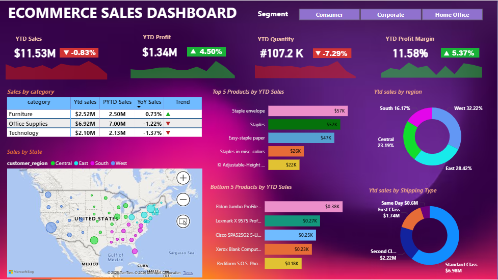

# E-Commerce-Sales-Dashboard (Power BI)

## E-Commerce-Sales - [https://github.com/jyotisharma-cyber/HR-ANALYTICS](https://github.com/jyotisharma-cyber/E-Commerce-Dashboard)

---
## E-Commerce Dashboard Screenshot

---

##  Project Overview
The **E-Commerce Sales Dashboard** is an interactive Power BI dashboard designed to analyze sales performance, profitability, product trends, regional performance, and shipping insights. This dashboard helps business stakeholders make data-driven decisions by providing a comprehensive view of key sales metrics.

---

##  Key Objectives

- Monitor Year-to-Date (YTD) Sales Performance
- Analyze YTD Profit and Profit Margin
- Track Product Category Performance
- Identify Top & Bottom Performing Products
- Analyze Regional Sales Distribution
- Monitor Shipping Mode Performance
- Visualize Sales Distribution by State

---

##  Key Metrics

| KPI | Value |
|------|--------|
| YTD Sales | $11.53M |
| YTD Profit | $1.34M |
| YTD Quantity | 107.2K |
| YTD Profit Margin | 11.58% |

---

##  Dashboard Insights

### Sales by Category
- Office Supplies generated the highest sales.
- Furniture contributed steady revenue growth.
- Technology category showed a slight decline compared to previous year.

### Top 5 Products by YTD Sales
- Staple Envelope
- Staples
- Easy-Staple Paper
- Staples in Misc. Colors
- KI Adjustable Height Desk

### Bottom 5 Products by YTD Sales
- Eldon Jumbo Profile Binders
- Lexmark X9575 Printer
- Cisco SPA525G2 Phone
- Xerox Blank Computer Paper
- Rediform S.O.S. Phone Message Book

### Regional Performance
- West Region contributed the highest sales share.
- East Region followed closely behind.
- Central and South regions showed moderate performance.

### Shipping Analysis
- Standard Class accounted for the majority of sales.
- Second Class was the second most used shipping method.
- Same Day shipping contributed the least sales volume.

---

##  Tools & Technologies Used

- **Power BI**
- **Microsoft Excel**
- **Data Modeling**
- **DAX (Data Analysis Expressions)**
- **Power Query**
- **Data Visualization**

---

##  Dataset Features

The dataset includes:

- Order ID
- Order Date
- Customer Name
- Product Name
- Category
- Sales
- Profit
- Quantity
- Region
- State
- Shipping Mode

---

##  Business Benefits

✔ Identify high-performing products

✔ Track sales and profitability trends

✔ Understand customer purchasing patterns

✔ Evaluate regional market performance

✔ Optimize shipping strategies

✔ Support strategic business decisions

---

##  How to Use

1. Download the `.pbix` file.
2. Open it in Power BI Desktop.
3. Refresh the dataset if needed.
4. Use filters and slicers to explore insights.
5. Analyze KPIs and trends interactively.

---

##  Contact

### Jyoti Kashyap

Data Analyst | Power BI Developer

🔗 GitHub: https://github.com/jyotisharma-cyber

---

⭐ If you found this project useful, please give it a star on GitHub!
